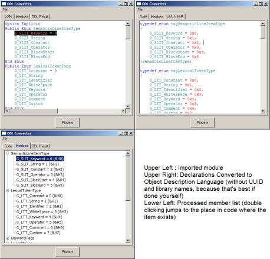



## Convert VB Type, API and Enum \-\> VC\+\+ ODL \(With Colorization\)

### Description

The ODL Converter Project is designed to take VB Types, Enums and Declare Statements and convert them into a format used by Visual C++'s .odl files (odl = Object Description Language).

This also shows how to colorize code, for those who are interested
 
### More Info
 
Visual Basic Modules

You must know the odl format in order for this to work correctly. The purpose of this code is to allow people who want to re-use api declarations (rather then hunting through hundreds in the api viewer) in other projects quickly, and effectively.

This also assumes you know how to obtain a UUID and name the library so that it doesn't conflict with another on the computer.

Also, when using .tlb files generated from .odl files, you must realize that the declares

Text ready to be put into .odl files of your own.

             |
---                |---
**Submitted On**   |2001-11-07 23:55:02
**By**             |[Linguar Amadala](https://github.com/Planet-Source-Code/PSCIndex/blob/master/ByAuthor/linguar-amadala.md)
**Level**          |Advanced
**User Rating**    |4.8 (19 globes from 4 users)
**Compatibility**  |VB 6\.0
**Category**       |[String Manipulation](https://github.com/Planet-Source-Code/PSCIndex/blob/master/ByCategory/string-manipulation__1-5.md)
**World**          |[Visual Basic](https://github.com/Planet-Source-Code/PSCIndex/blob/master/ByWorld/visual-basic.md)
**Archive File**   |[Convert\_VB339301182001\.zip](https://github.com/Planet-Source-Code/linguar-amadala-convert-vb-type-api-and-enum-vc-odl-with-colorization__1-28728/archive/master.zip)

